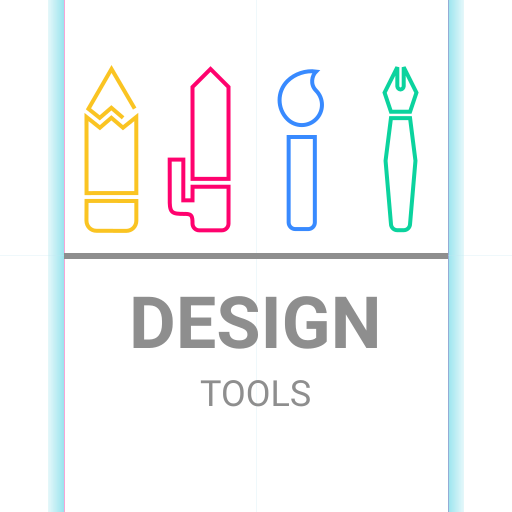
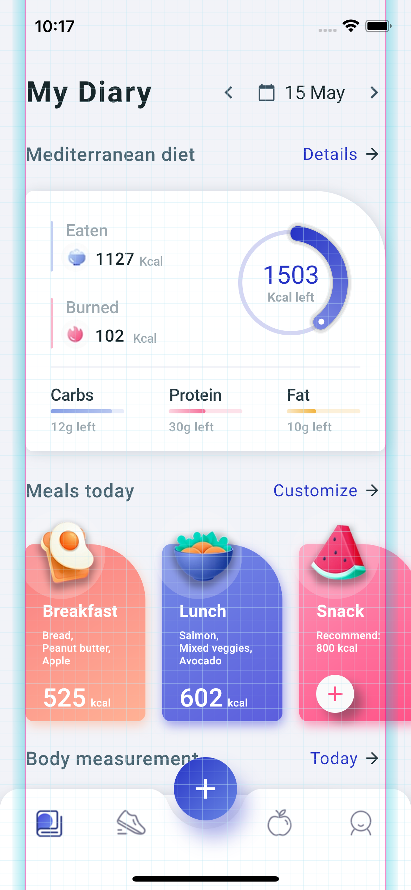
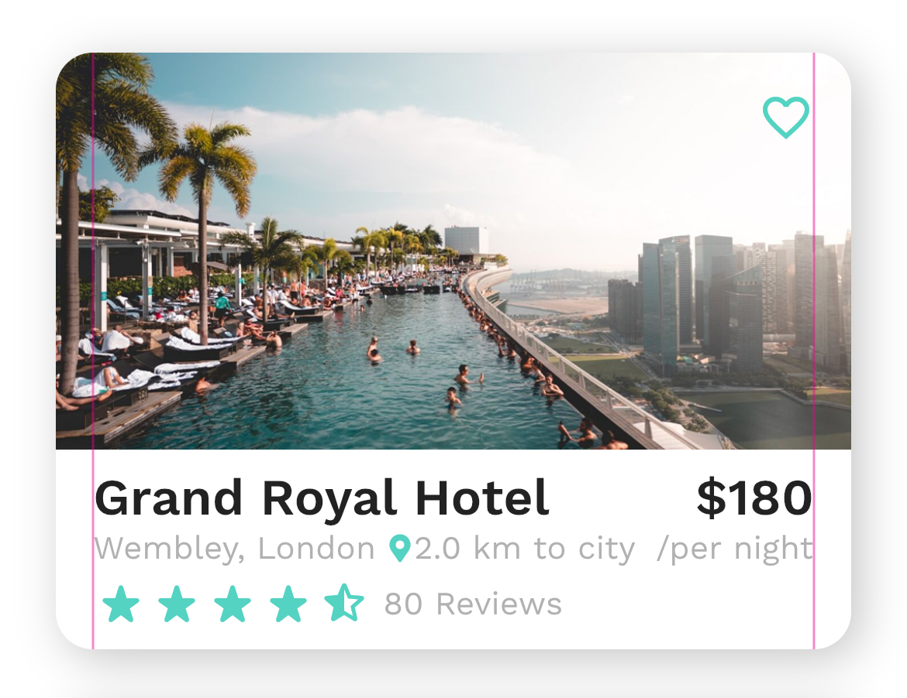

<p align="center">
  
</p>

# Main Features
- Gridlines
- Keylines


# Quickstart

Add Design Tools to flutter project dependency
```yaml
dependencies:
  design_tools: ^0.1.0
```
## Design Tools for App
Wrap App in DesignTools widget
```dart
import 'package:design_tools/design_tools.dart';

void main() => runApp(
  DesignTools(
    child : MyApp(),
  )
)
```
<p align="start">
  
</p>

## Design Tools for widget
Wrap your Widget in DesignTools widget

```dart
import 'package:design_tools/design_tools.dart';

DesignTools(
  child : MyWidget(),
)
```

<p align="start">
  
</p>

# Customisations

[DesignTools](lib/src/design_tools.dart)
| variable           |     Type      | usage                                          |
| ------------------ | :-----------: | ---------------------------------------------- |
| verticalInterval   | GuideInterval | to specify the vertical guides, null to skip   |
| horizontalInterval | GuideInterval | to specify the horizontal guides, null to skip |
| keylines           | Keyline List  | to specify the keylines, empty-array to skip   |

[GuideInterval](lib/src/design_models.dart#L16)
| variable                          |  Type  | usage                                                                         |
| --------------------------------- | :----: | ----------------------------------------------------------------------------- |
| intervals                         |  int   | intervals between each guide line                                             |
| divisions                         |  int   | divisions between each interval, if two each interval is split to 2 divisions |
| decoration.intervalWidth          | double | interval seperator line width                                                 |
| decoration.intervalColor          | color  | interval seperator line color                                                 |
| decoration.divisionSeperatorWidth | double | divisions seperator line width                                                |
| decoration.divisionSeperatorColor | color  | divisions seperator line color                                                |

[Keyline](lib/src/design_models.dart#L108)
| variable                    |      Type      | usage                                          |
| --------------------------- | :------------: | ---------------------------------------------- |
| xPos                        |     double     | position at which ketLine is drawn             |
| gravity                     | KeylineGravity | specifies xPos relative to start or end        |
| decoration.lineWidth        |     double     | keyline width                                  |
| decoration.lineColor        |     color      | keyline color                                  |
| decoration.marginWidth      |     double     | If keyline margin is required, width of margin |
| decoration.marginStartColor |     color      | keyline margin start color                     |
| decoration.marginEndColor   |     color      | keyline margin end color                       |

# Mentions
- @mitesh77 for wonderful UI templates [Flutter UI Templates](https://github.com/mitesh77/Best-Flutter-UI-Templates)
- @aloisdeniel for [Flutter Device Preview](https://github.com/aloisdeniel/flutter_device_preview) : motivation for this library